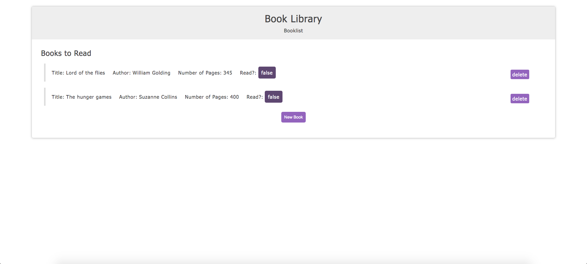

# Library App

It's a Library app that allows users to add books to a list and delete it and change the "read" to true or false.




## Built With

- HTML
- CSS
- JavaScript


## Live Demo

[Gameshark Articles](https://gameshark-articles-ror.herokuapp.com/)


## Getting Started

- First get a local copy of the project by forking it or just clone it typing this at your terminal inside your favorite folder:
```
$ git clone git@github.com:mahmoud717/js-library.git
```

- CD into the repository


### Github Actions

To make sure the linters' checks using Github Actions works properly, you should follow the next steps:

1. On your recently forked repo, enable the GitHub Actions in the Actions tab.
2. Create the `feature/branch` and push.
3. Start working on your milestone as usual.
4. Open a PR from the `feature/branch` when your work is done.


## ✒️ Authors <a name = "author"></a>

👤 **Luciano Ilha Carbonel**

- Github: [@Luciano Ilha](https://github.com/luciano-ilha)
- Twitter: [@CarbonellIlha](https://twitter.com/CarbonellIlha)
- Linkedin: [@Luciano Carbonell](https://www.linkedin.com/in/luciano-carbonell/)

👤 **Mahmoud Mohammad**

- Github: [@mahmoud717](https://github.com/mahmoud717)
- Twitter: [@mahmoud26369406](https://twitter.com/mahmoud26369406)
- Linkedin: [@Mahmoud Mohammad](https://www.linkedin.com/in/mahmoud-m-abbas/)


## 🤝 Contributing

Contributions, issues and feature requests are welcome!

Feel free to check the fork this repo and create pull request if you want to make changes.

## Show your support :muscle:

Give a ⭐️ if you like this project!

## :thumbsup: Acknowledgements

- Microverse  
- ThOdinProject
